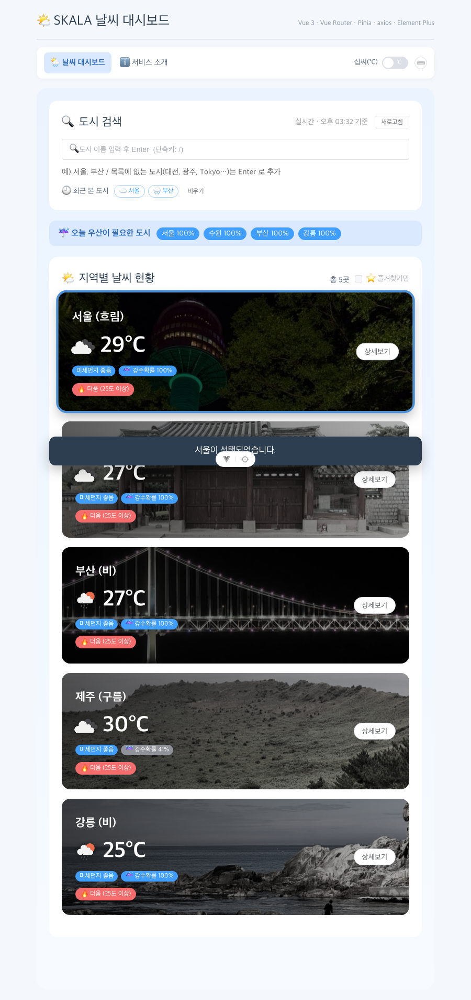

# skala-vue

SKALA Vue.js 과정에서 만든 날씨 대시보드입니다.
mock 데이터로 만든 카드 화면을 시작으로 컴포넌트 분리 → 라우터 → Pinia → 실제 API → UI 라이브러리 순서로 계속 쌓아가면서 진행했습니다.

배포: <https://skala-vue-taupe.vercel.app/>



## 실행

```bash
npm install
cp .env.example .env   # VITE_OPENWEATHER_API_KEY 에 OpenWeather 키 입력
npm run dev
```

키가 없어도 앱은 뜹니다. 샘플 데이터로 돌아가고 상단에 경고만 보여줍니다.

## 기능

메인 대시보드
- 도시별 현재 날씨 카드 (OpenWeather), 미세먼지 등급 (Open-Meteo), 12시간 내 강수확률. 25도 기준 더움/선선함 라벨
- 검색창에 도시 이름을 치면 한글 조합 중에도 바로 걸러짐. 목록에 없는 도시(대전, Tokyo 등)를 치고 Enter → 추가할지 확인창 → Geocoding으로 찾아서 카드 추가. 추가한 도시는 localStorage에 남고, 카드 오른쪽 위 ✕ 버튼이나 우클릭 메뉴로 제거(확인창). 기본 5개 도시는 못 지움
- 즐겨찾기: 카드 우클릭 메뉴나 상세 페이지 별 버튼으로 추가/해제, localStorage 저장, 목록 위 체크박스로 즐겨찾기만 보기
- 오늘 우산이 필요한 도시: 검색창 바로 아래 배너. 강수확률 60% 이상인 도시를 확률 순으로 칩으로 보여주고, 누르면 상세로 이동
- 최근 본 도시: 검색창 아래 칩 3개. 누르면 상세로, 페이지를 오가도 유지(Pinia), 비우기 버튼
- 상태바: 카드 선택, 즐겨찾기 추가/해제, 도시 제거 결과를 화면 하단에 고정된 바로 표시
- 새로고침 버튼과 마지막 갱신 시각. 첫 로딩 중엔 스켈레톤, 검색 결과 없으면 빈 화면 + 도시 추가 버튼
- API 키가 없거나 요청이 실패하면 샘플 데이터로 표시하고 상단에 경고. 일부 도시만 실패하면 그 카드에만 "샘플" 표시

상세 페이지
- 지역, 기온(체감), 날씨, 습도, 풍속, 기압, 일출/일몰, 12시간 내 강수확률
- 미세먼지 PM10 / PM2.5 게이지 (환경부 기준 등급 색상)
- 3시간 간격 24시간 예보, 즐겨찾기 버튼
- 없는 도시 코드(/weather/city_99)면 안내 화면, 그 외 잘못된 주소는 404 페이지

공통
- 섭씨/화씨 전환 스위치 (카드, 상세, 예보 전부 반영)
- 조작 안내: 키보드 단축키 `/` 검색창 포커스, `Enter` 검색, `Esc` 닫기/뒤로. 마우스는 카드 더블클릭으로 상세, 우클릭으로 메뉴(상세보기 / 즐겨찾기 / 날씨 요약 복사 / 제거). 상단 ⌨️ 버튼을 누르면 같은 내용이 앱 안에 뜸
- 카드에 마우스를 올리면 흑백 사진이 컬러로 변경, 선택하면 완전 컬러 + 테두리

## 사용 기술과 선택 이유

**Element Plus** — UI 라이브러리는 이것 하나만 썼습니다. 이 앱에 필요한 건 레이아웃보다 입력창, 태그, 스켈레톤, 빈 화면, 경고 같은 부품인데, Element Plus가 다른 UI 라이브러리들과 비교했을 때 이런 부품이 제일 많고 기본 스타일이 무난합니다. `app.use()` 한 줄이면 전역 등록이라 시작이 쉬웠습니다. 대신 번들이 큽니다.

**axios** — fetch보다 인스턴스 + interceptor가 편했습니다. `weatherApi.js`에서 API 키와 `units=metric`을 interceptor가 자동으로 붙이고, 401/429 같은 에러는 한글 메시지로 바꿔서 던집니다.

**Pinia** — 처음엔 props/emits로만 했는데 단위 설정 하나 바꾸는 데 부모까지 올라갔다 내려와야 했습니다. store로 올리니 UnitToggler가 어디 있든 상관없어졌습니다. 날씨 데이터도 store에 두니 메인 ↔ 상세 이동할 때 다시 안 부릅니다.

**OpenWeather + Open-Meteo** — 현재 날씨, 예보, Geocoding은 OpenWeather를 썼습니다. 미세먼지는 OpenWeather 무료 플랜에 없어서 키 없이 되는 Open-Meteo를 썼습니다.

**Postman** — 코드 짜기 전에 응답 JSON 데이터 형태(`main.temp`, `weather[0].icon`, 예보의 `pop`)를 먼저 확인했습니다. 콘솔에 찍어가며 찾는 것보다 빨랐습니다.

## HandsOn에 따른 개발 순서

1. **Mockup** — v-for, v-if, `:value`+`@input`, `@click.stop`. 도시를 5개로 늘리고 미세먼지·강수확률 필드, 사진 배경, 우산 필요한 도시 박스를 추가했습니다
2. **Composition** — computed로 필터/정렬/평균기온, watch·watchEffect로 콘솔 로그를 남겼습니다
3. **Component** — WeatherParent / BaseDashboardCard(slot) / SearchBar / WeatherCard로 분리했습니다. StatusBar, UmbrellaList는 추가로 분리한 것입니다
4. **Router** — 지연 로딩, `/weather/:cityId`, catch-all. alert 대신 `router.push`를 씁니다. 없는 도시 코드면 안내 화면이 뜹니다
5. **Pinia** — configStore(단위), historyStore(방문 기록). 나중에 weatherStore, favoriteStore를 추가했습니다
6. **axios** — 대시보드에 실제 데이터를 넣었습니다. 도시마다 현재/예보/미세먼지 3개 요청을 `Promise.all`로, 도시 간엔 `allSettled`로 묶어서 하나 실패해도 나머지는 보이게 했습니다
7. **Element Plus** — 검색창, 태그, 스위치, 체크박스, 스켈레톤, 빈 상태, 경고, 수치 표, 게이지, 다이얼로그, 토스트에 적용했습니다
8. **빌드** — lint 0, `.env` 분리, 청크 분리, SPA 새로고침용 `vercel.json`

## 배운 점 && Trouble Shooting

- 같은 앱을 계속 고치니까 왜 컴포넌트를 세부적으로 나누는지, 유지보수를 위해 그렇게 한다는 수업 때 말씀을 체득했습니다. 파일 하나가 400줄을 넘어가면서 컴포넌트를 나누게 됐고, 부모-자식 왕복이 헷갈려지면서 수업에서 배운 store로 해결했습니다.
- 슬롯 안의 자식은 부모 스코프에서 컴파일된다는 말을 처음엔 몰랐는데, BaseDashboardCard 안의 SearchBar에 부모가 바로 `@update-query`를 거는 걸 보고 이해했습니다.
- 외부 API는 실패하는 상황을 기본으로 두고 설계해야 한다는 점을 배웠습니다. 키 없음, 키 미활성화, 도시 하나만 실패를 다 따로 처리해야 앱이 죽지 않는 것을 확인했습니다.
- 트러블슈팅, 검색창에서 한글 마지막 글자가 검색에 반영 안 됨: 검색창을 el-input으로 바꾼 뒤 "수원"을 치면 화면에는 "수원"이 보이는데 검색어는 "수워"에 멈춰서 카드가 0개가 됐습니다. el-input이 한글 조합 중에는 input 이벤트를 안 보내길래 처음엔 `@compositionupdate`로 받았는데, 이 이벤트는 브라우저가 입력값을 바꾸기 전에 발생해서 값이 항상 한 글자 늦었습니다. el-input이 expose하는 안쪽 input 요소에 네이티브 input 리스너를 직접 달아서 해결했습니다.
